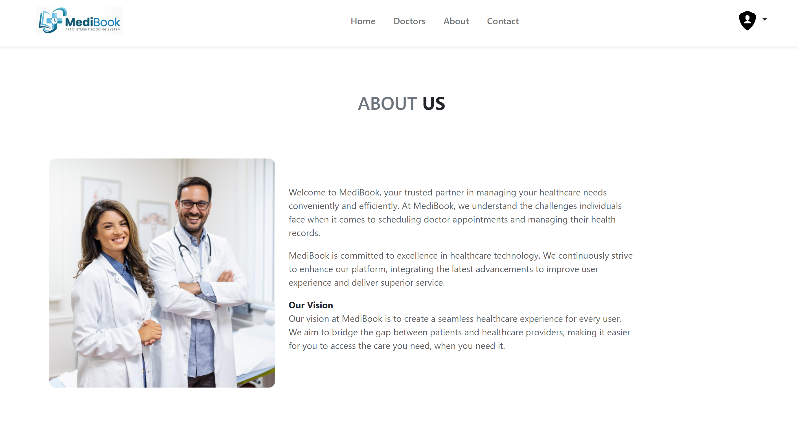
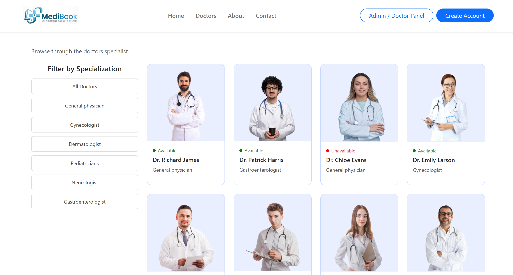
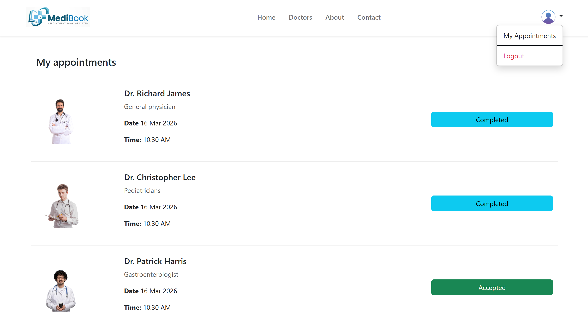
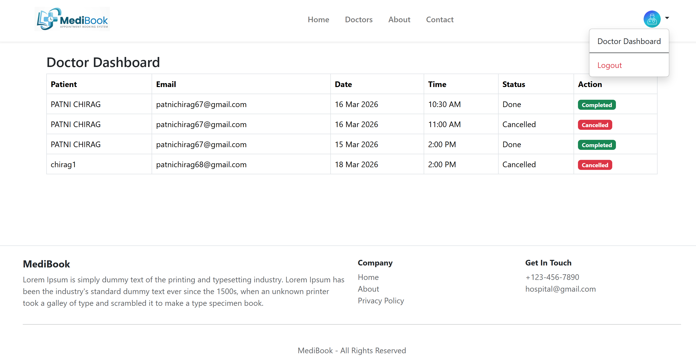
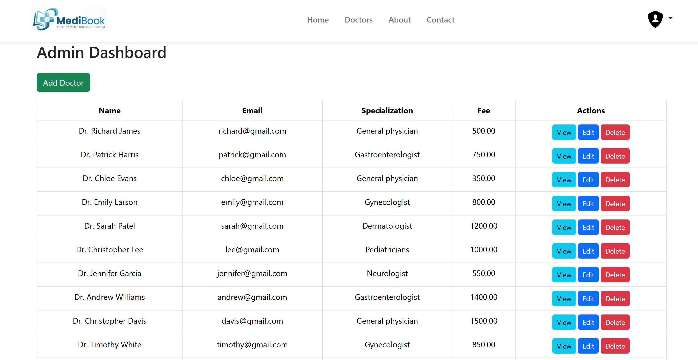
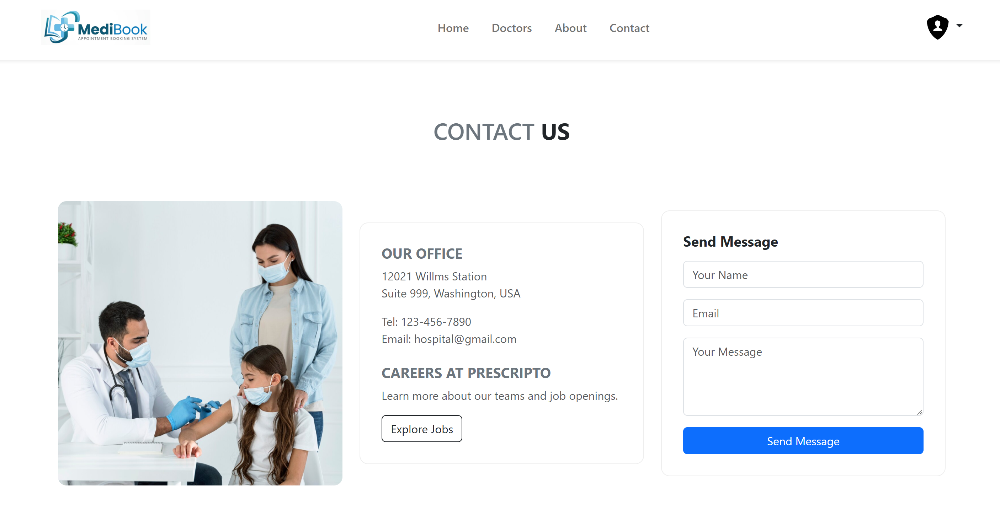

# MediBook - Hospital Appointment Booking System

## Project Description
MediBook is a Hospital Appointment System built using ASP.NET Core and SQL Server.
It allows patients to book appointments with doctors online.

## Features
- Patient Registration & Login
- Doctor Dashboard
- Book Appointment
- Admin Panel
- View Appointment History

## Technologies Used
- ASP.NET Core MVC
- Entity Framework Core
- SQL Server
- Bootstrap
- 
## Screenshots

### Home Page

### About Page

### Doctor List

### Appointment Page

### Doctor Dashboard

### Admin Dashboard

### Contact Page

## Author
Chirag Patni
